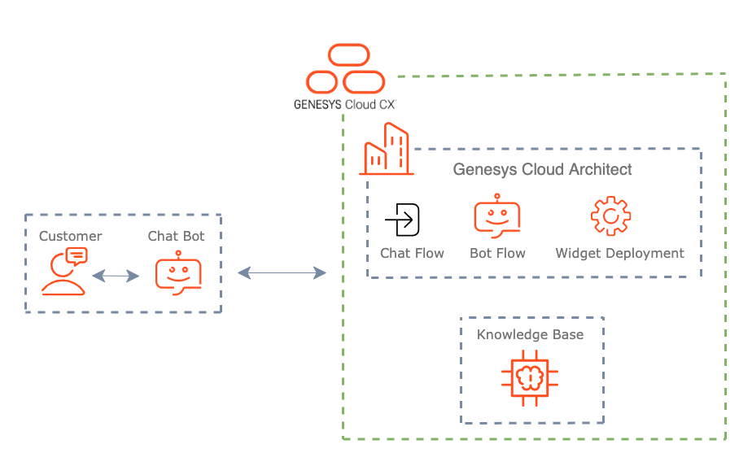

# Build a Web messaging chatbot that integrates with a knowledge base to answer customer inquiries (DRAFT)
View the full article, [Build a Web messaging chatbot that integrates with a knowledge base to answer customer inquiries](https://developer.genesys.cloud/blueprints/web-messaging-chatbot-with-knowledge-base "Build a Web messaging chatbot that integrates with a knowledge base to answer customer inquiries"), on the Developer Center. 

This blueprint demonstrates how to use Genesys Cloud web messaging with a Genesys Cloud knowledge base.

:::primary
**Note:** This blueprint is for the Knowledge workbench V1.  In a future update, an example will be added for Knowledge workbench V2. 
:::

You can view the complete blueprint and download the sample files from [here](https://github.com/GenesysCloudBlueprints/web-messaging-chatbot-with-knowledge-base "Build a Web messaging chatbot that integrates with a knowledge base to answer customer inquiries").

