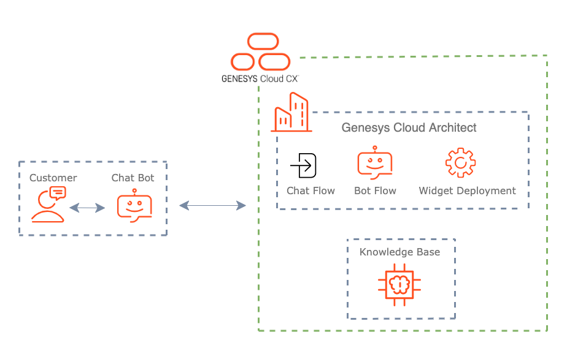
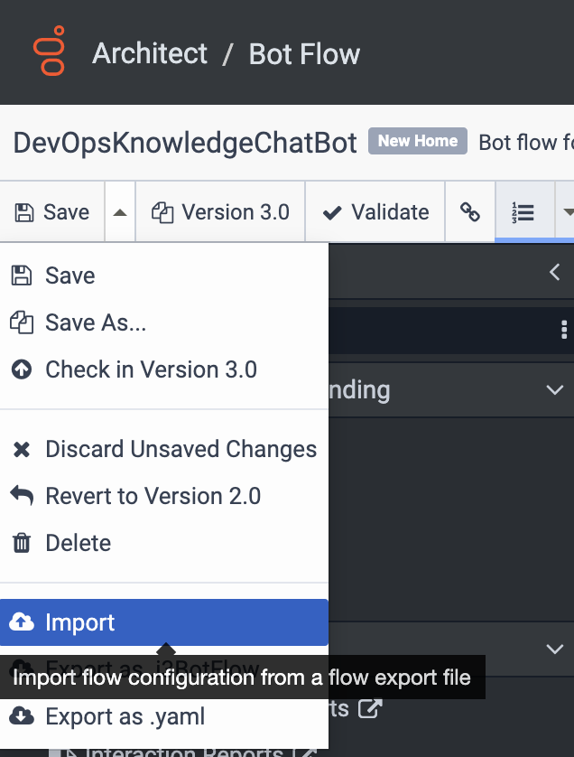
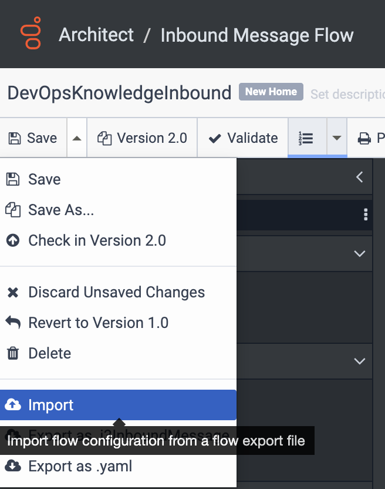
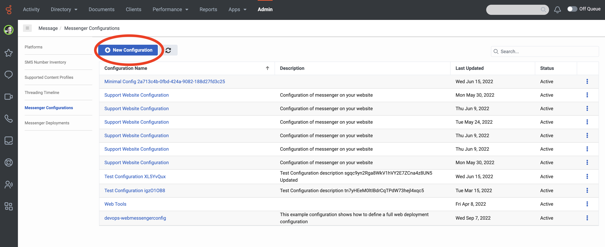
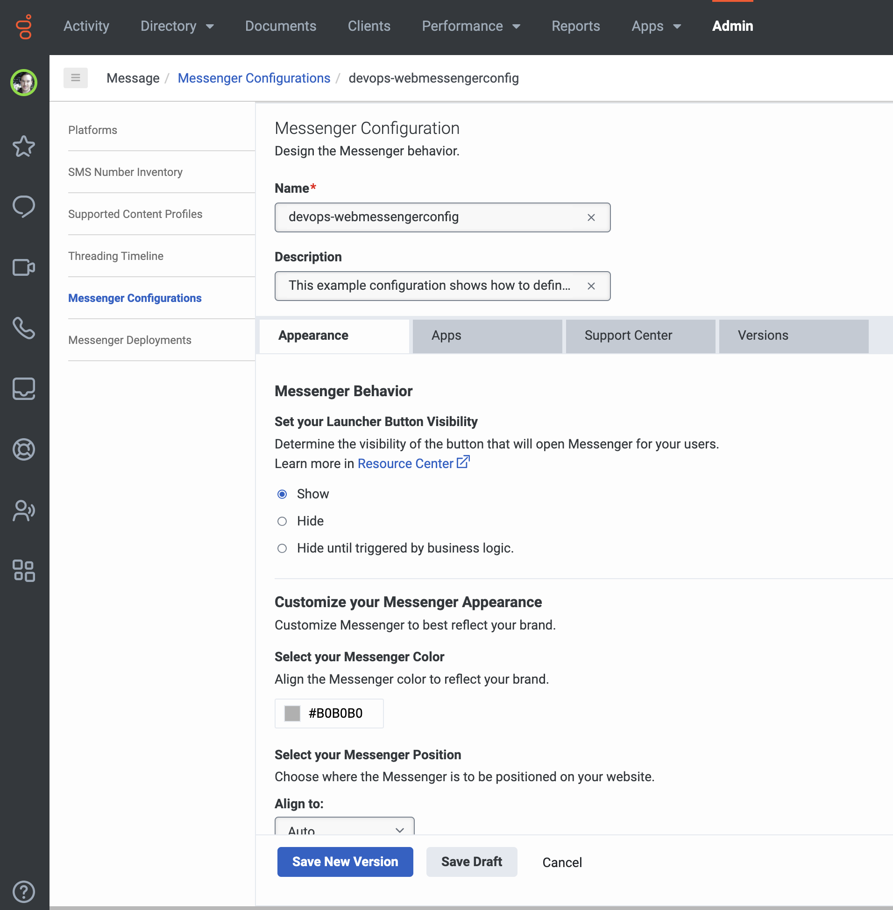
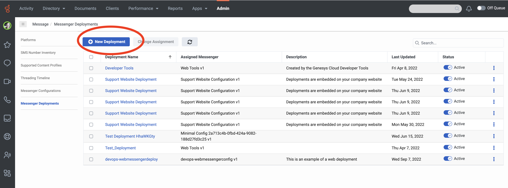
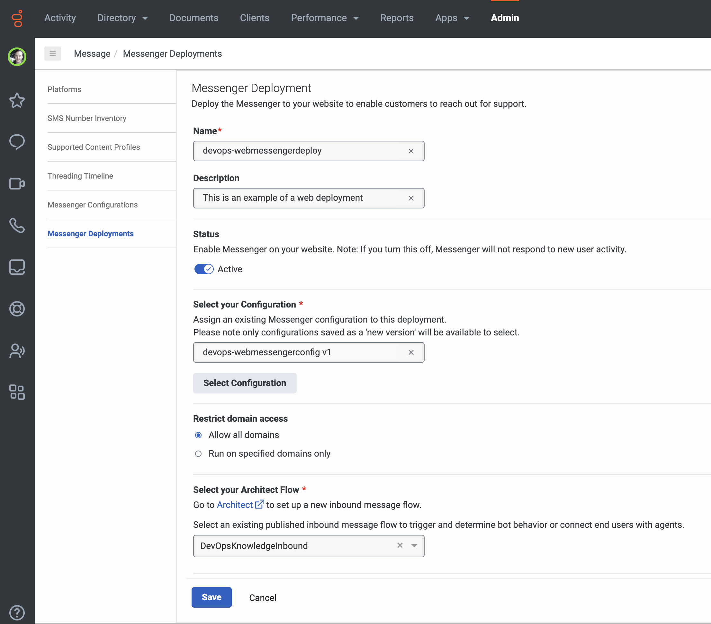
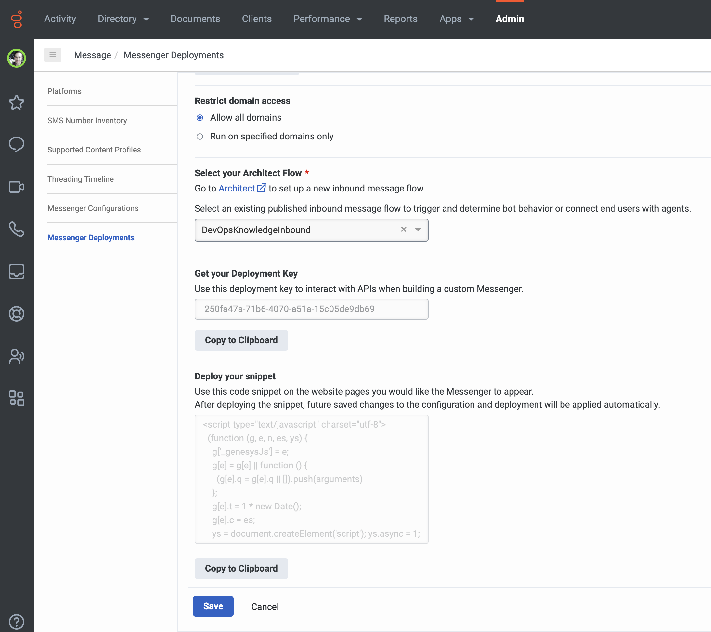

This Genesys Cloud Developer Blueprint demonstrates how to build a Web messaging chatbot and integrate that chatbot with a Genesys Cloud knowledge base. All the components used in this solution can be deployed using Terraform and the Terraform Genesys Cloud CX as Code provider.




## Scenario

An organization is interested in building a chatbot that can answer documented and frequently asked customer questions.  They want to:

* Implement a custom chatbot that can be quickly added to any desired customer-facing webpage.

* Create the chatbot with minimal coding effort.

* Backup solution components and track state with CX as Code.

## Solution

This blueprint explains how to use the following Genesys Cloud capabilities: 

1. **Knowledge Base** - stores documentation and frequently asked questions and leverages AI for greater flexibility in the recognition of customer inquiries.
2. **Knowledge Workbench** - provides a console for the management of Knowledge Bases including document management, version control, and analytics.
1. **Bot Flow** - configures utterances and intents for speech and text recognition and can leverage a knowledge base for determining automated responses. 
2. **Inbound Message Flow** - configures the routing for the Web messaging conversation and directs the chat to the correct recipient.
4. **Web Messaging Widget** - a JavaScript-based chat widget that developers can plug in to their organization's website for customers to interact with.

## Solution components

* **Genesys Cloud CLI** - A command line interface for making REST requests to the Genesys Cloud Public API.
* **Genesys Cloud CX** - A suite of Genesys Cloud services for enterprise-grade communications, collaboration, and contact center management. In this solution, you use an Architect bot, Architect message flow, a Genesys Cloud knowledge base, the Genesys Cloud Knowledge Workbench, and a web messaging widget.
* **CX as Code** - A Genesys Cloud Terraform provider that provides an interface for declaring core Genesys Cloud objects.

## Software development kits

No Genesys Cloud SDKs are needed for this blueprint.

## Prerequisites

### Specialized knowledge

* Administrator-level knowledge of Genesys Cloud
* Experience with Terraform

### Genesys Cloud account

* A Genesys Cloud license. For more information see, [Genesys Cloud Pricing](https://www.genesys.com/pricing "Opens the Genesys Cloud pricing page") in the Genesys website. 
* Master Admin role. For more information see, [Roles and permissions overview](https://help.mypurecloud.com/?p=24360 "Goes to the Roles and permissions overview article") in the Genesys Cloud Resource Center.
* CX as Code. For more information see, [CX as Code](https://developer.genesys.cloud/api/rest/CX-as-Code/ "Goes to the CX as Code page") in the Genesys Cloud Developer Center.

### Development tools running in your local environment

* Terraform (the latest binary). For more information, see [Download Terraform](https://www.terraform.io/downloads.html "Goes to the Download Terraform page") on the Terraform website.
* Golang 1.16 or higher. For more information, see [Downloads](https://go.dev/dl/ "Goes to the Downloads page") on the Go website.
* Genesys Cloud CLI (latest version). For more information, see [Platform API CLI](https://apps.mypurecloud.com/knowledge-workbench/#/knowledgeBases)
* Python version 3. For more information, see [Python 3 Installation & Setup Guide](https://realpython.com/installing-python/)

## Implementation steps

### Clone the GitHub repository

Clone the [web-messaging-chatbot-with-knowledge-base](https://github.com/GenesysCloudBlueprints/web-messaging-chatbot-with-knowledge-base) GitHub repository on your local machine. The `web-messaging-chatbot-with-knowledge-base` root folder includes solution-specific scripts and files in these subfolders:

* `request-data` - Files containing JSON payloads to be passed as arguments to Genesys Cloud CLI commands for the creation of the knowledge base and the indexing of content.
* `terraform` - All Terraform files and Architect flows that are needed to deploy the solution.

### Set up your Genesys Cloud credentials

1. To run this project using the AWS Terraform provider, open a Terminal window and set the following environment variables:

 * `GENESYSCLOUD_OAUTHCLIENT_ID` - This is the Genesys Cloud client credential grant Id that CX as Code executes against. 
 * `GENESYSCLOUD_OAUTHCLIENT_SECRET` - This is the Genesys Cloud client credential secret that CX as Code executes against. 
 * `GENESYSCLOUD_REGION` - This is the Genesys Cloud region in your organization.

2. Run Terraform in the Terminal window where you set the environment variables.

:::primary
**Note:** For this project, the Genesys Cloud OAuth client requires the Master Admin role. 
:::

### Method 1: Using the Genesys Cloud CLI and the Genesys Cloud Application

:::primary
**Note:** Skip this step if using Method 2 (Terraform/CX as Code)
:::

#### Set up the Genesys Cloud CLI

1. Configure the profile for the CLI to enable authorized requests to the Genesys Cloud Public API. See more at [Setting up the CLI](https://developer.genesys.cloud/devapps/cli/#setting-up-the-cli)

#### Create the knowledge base 

1. Open a new terminal window.
2. Set the working directory to the `request-data` folder.
3. Run `gc knowledge knowledgebases create -f create-knowledge-base.json`

#### Add documents to the knowledge base

1. Determine the `knowledgeBaseId` by running `gc knowledge knowledgebases list` and finding the id for the knowledge base created in the previous step.
2. For each of the `knowledge-base-document-[n].json` files, run `gc knowledge knowledgebases documents create [knowledgeBaseId] -f knowledge-base-document-[n].json`
3. For each of the `knowledge-base-document-variation-[n].json` files, run `gc knowledge knowledgebases documents variations create [knowledgeBaseId] [documentId] -f knowledge-base-document-variation-[n].json`
4. For each of the documents created, publish a new document version by running `gc knowledge knowledgebases documents versions create [knowledgeBaseId] [documentId] -f create-document-version.json`

#### Create the Architect components in the Genesys Cloud Application

1. Add a new bot flow in Architect.

2. Import `flow-data/DevOpsKnowledgeChatBot_v1-0.i3BotFlow`into the bot flow.

3. Publish the bot.
3. Add a new inbound message flow in Architect.

4. Import `flow-data/DevOpsKnowledgeInbound_v2-0.i3InboundMessage` into the inbound message flow.

5. Publish the inbound message flow.
5. Create a new Messenger configuration (configure as desired).


6. Create a web deployment configured to use the inbound message flow and the messenger configuration created in the previous steps.




#### Test the deployment

1. Take the JavaScript-based snippet from the Messenger deployment and add it to your organization's web page to test out customer interaction.
2. When prompted, enter a question that matches one contained in your knowledge base.
3. The chatbot should detect the match and respond with the answer stored in the knowledge base.
4. The chatbot will then ask if your question was answered successfully.  Answer yes if the chatbot answered the question.
5. Navigate to the [Knowledge Workbench](https://apps.mypurecloud.com/knowledge-workbench/#/knowledgeBases) and see the updated stats for the question.  The "Surfaced" and "Positive" counts will be incremented.

### Method 2: Using CX as Code

#### Configure your Terraform build

1. You must define 2 organization-specific variables.

In the terraform/architect/dev.auto.tfvars file, set the following values:

* `genesyscloud_scripting_url` - The Genesys Cloud apps URL specific to your organization's Amazon region used in generating the HTML page to test the Web Component.
* `genesyscloud_scripting_env` - This is a short code for the environment. This value is found immediately following `https://apps.<<VALUE HERE>>.pure.cloud` from the `genesyscloud_scripting_url`, or `use1` if the scripting url is `https://apps.mypurecloud.com`. 

Example `dev.auto.tfvars` file:

```
genesyscloud_scripting_env = "use1"
genesyscloud_scripting_url = "https://apps.mypurecloud.com"
```

2. Remember that if you update the names for the resources in the `terraform/architect/modules/flows` folder, you will need to update the names where appropriate in the YAML files used for Architect flow creation in the same folder.

#### Run Terraform for resource creation

With set up out of the way, you can now create the resources. 

1. Set the working directory to the `terraform` folder
2. Run `terraform init` - This initializes the working directory it prepares it for use with Terraform
3. Run `terraform plan` - This creates an execution plan, letting you preview the changes that will be made by the next `terraform apply` command. The preview includes the number of resources to be added, changed, and removed. Review the changes before moving on.
4. Run `terraform apply --auto-approve` - This creates the resources outlined in the plan. Upon completion, the output should be logs of the run along with the number of objects successfully created by Terraform. Keep these points in mind:
5. Verify that a new folder `web` is created with two files, `index.html` and `server.py`

*  This project assumes you are running using a local Terraform backing state. This means that the `tfstate` files will be created in the same folder where you ran the project. Terraform does not recommend using local Terraform backing state files unless you run from a desktop and are comfortable with the deleted files.

* As long as your local Terraform backing state projects are kept, you can tear down the blueprint in question by changing to the `terraform` folder and issuing a `terraform destroy --auto-approve` command. This destroys all objects currently managed by the local Terraform backing state.

#### Test the deployment

1. Set the working directory to the folder `web` created in the previous step.
2. Run `python3 server.py`
3. Open a browser window and navigate to `http://localhost:8080`
4. Wait for the Messenger icon to appear in the bottom right corner and click on it.
5. When prompted, enter a question that matches one contained in your knowledge base.
6. The chatbot should detect the match and respond with the answer stored in the knowledge base.
7. The chatbot will then ask if your question was answered successfully.  Click yes.
8. Navigate to the [Knowledge Workbench](https://apps.mypurecloud.com/knowledge-workbench/#/knowledgeBases) and see the updated stats for the question.  The "surfaced" and "positive response" counts will be incremented.

## Additional resources

* [Genesys Cloud Web messaging and Messenger](https://developer.genesys.cloud/commdigital/digital/webmessaging/ "Goes to the Web messaging and Messenger page") in the Genesys Cloud Developer Center
* [Knowledge Overview](https://developer.genesys.cloud/useragentman/knowledge/)
* [Terraform Registry Documentation](https://registry.terraform.io/providers/MyPureCloud/genesyscloud/latest/docs "Opens the Genesys Cloud Terraform provider page") in the Terraform documentation
* [web-messaging-chatbot-with-knowledge-base repository](https://github.com/GenesysCloudBlueprints/web-messaging-chatbot-with-knowledge-base "Goes to the web-messaging-chatbot-with-knowledge-base repository") in Github
